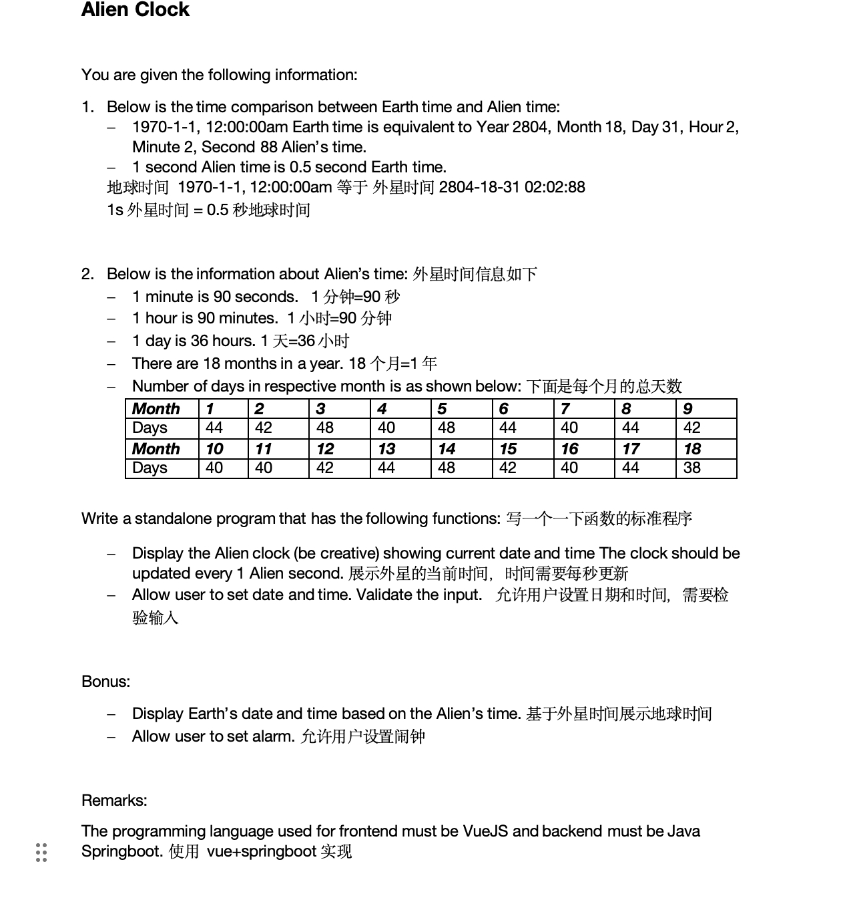
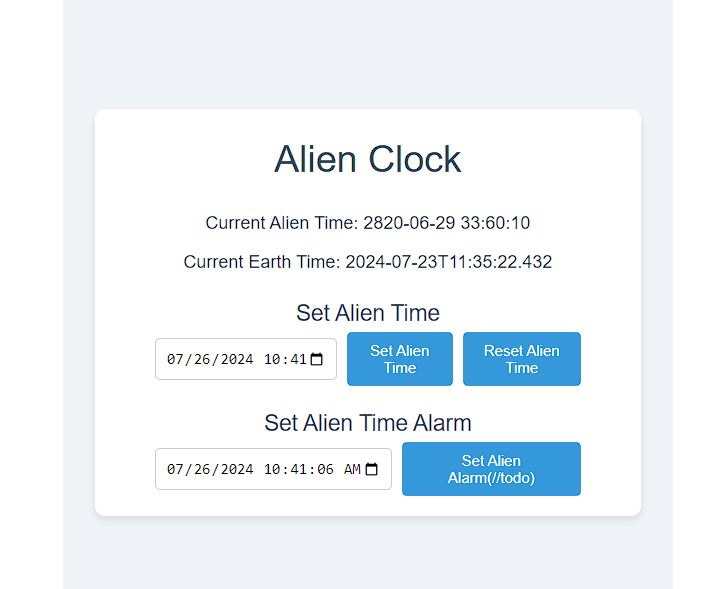

项目内容：字符操作或其他功能。

本人用的版本：
JDK：1.8
MAVEN: 3.8.6

SpringBoot: 2.7.18

==============================================================

外星时钟：



外星时钟效果图：


最新更新时间：2024-27-28
闹钟功能：到达设定时间后会循环播放[播放的是汤家风老师的励志上课音频]
新增了时间验证功能
===================
遗憾：
本人对前端不是很熟悉，后端抛出自定义异常前端获取不到，前端只能获取到500异常。
希望有懂前端的伙伴指导一下，万分感谢。

前端项目起步：

## Project Setup

```sh
npm install
```

### Compile and Hot-Reload for Development

```sh
npm run dev
```

### 
