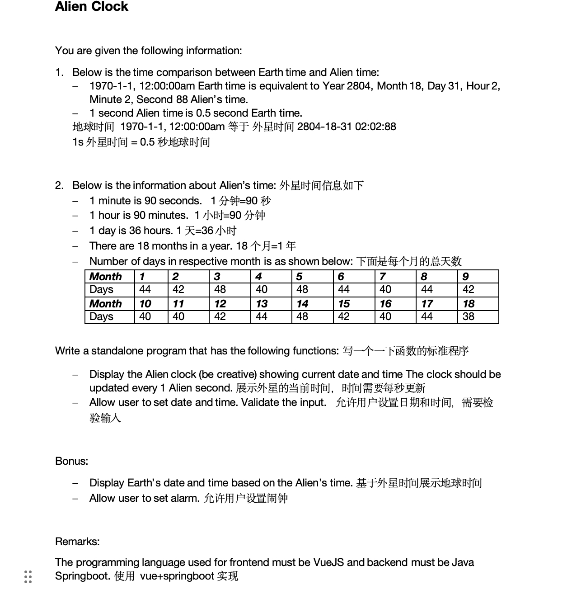
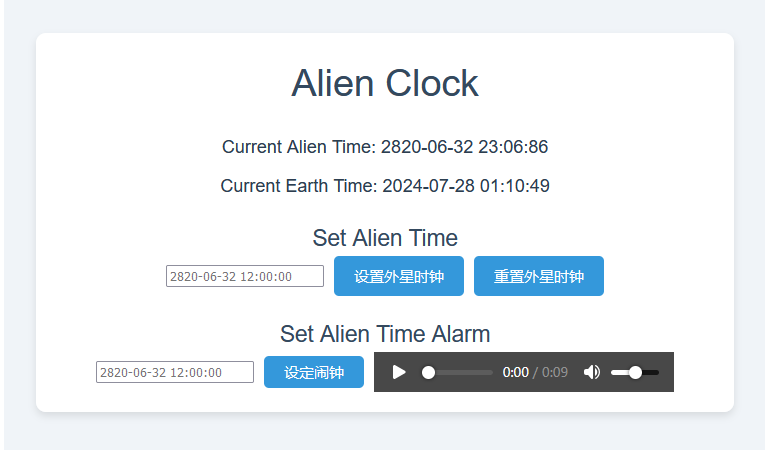

项目内容：字符操作或其他功能。

本人用的版本：
JDK：1.8
MAVEN: 3.8.6

SpringBoot: 2.7.18

==============================================================

外星时钟：



外星时钟效果图：



-----------------------------------------------
最新更新时间：2024-27-28
闹钟功能：到达设定时间后会循环播放【播放的是汤家风老师的励志演讲音频】

新增了时间验证功能

---------------------

使用说明：
【设置外星时钟】：在input标签输入框输入你指定时间后，再点击【设置外星时钟】button即可完成设置。
【重置外星时钟】：点击【重置外星时钟】即可回到当前外星时间。
【设定闹钟】：在input标签输入框输入你指定时间后，再点击【设定闹钟】button即可完成，等待时间到来即可。
额外补充：
   前端启动后，第一次会自动播放音频，本人用的是audio标签，不知是为何会自动播放，希望有人告知，谢谢。

-------------------------------


前端项目起步：

## Project Setup

```sh
npm install
```

### Compile and Hot-Reload for Development

```sh
npm run dev
```
浏览器查看：
http://localhost:5173/
### 
